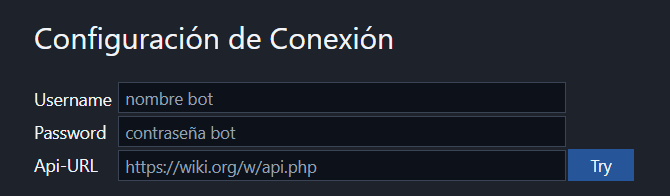
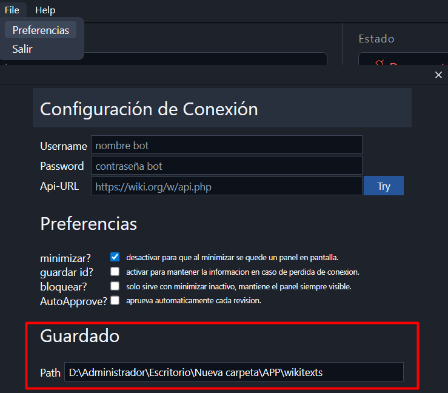
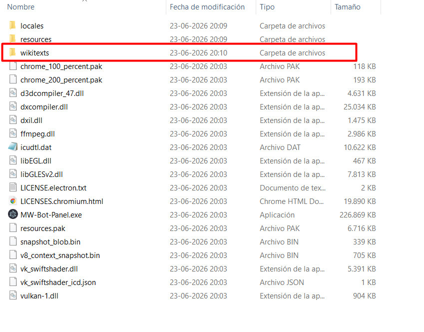
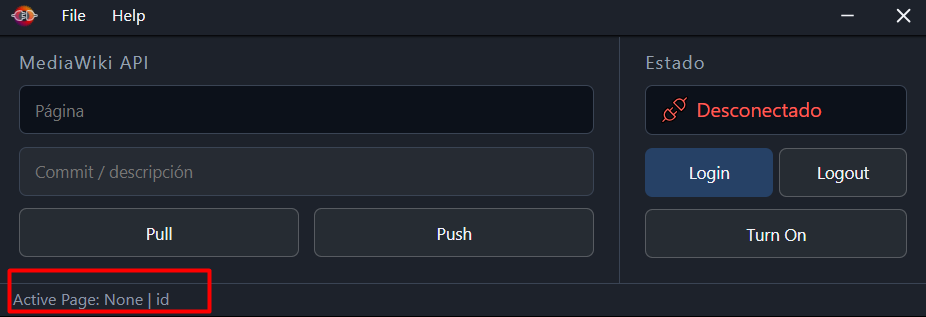
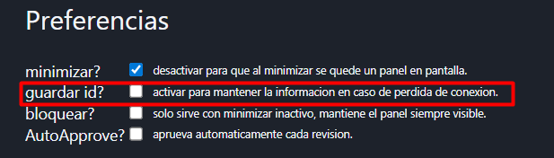
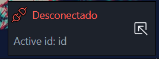
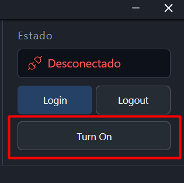

# WikiDesk

Aplicación de escritorio en **Windows**, con posible futura compilacion para linux y otros OS, para gestionar y automatizar las interacciones con instancias privadas de MediaWiki.

**Nota:** Documento en mantenimiento continuo.

## Indice

1. [Inicio Rápido](#inicio-rápido)
    1. [Instalación y ejecución](#instalación-y-ejecución)
    2. [Login](#login)
2. [Documentación](#documentación)
    1. [Guardado](#guardado)
    2. ['Active Page'](#active-page)
    3. [Mini Panel](#mini-panel)
    4. ['Turn On'](#turn-on)

## Inicio Rápido

### Instalación y ejecución
Descargar la última versión desde el repositorio, extraer el contenido en una carpeta local y ejecutar `WikiDesk.exe`.

### Login
Para autenticar, utiliza credenciales de **BotPasswords** generadas en tu instancia de MediaWiki bajo *Special:BotPasswords*.

## Documentación

### Guardado
Define el directorio local donde se almacenarán los archivos `.wikitext` procesados. Si el directorio indicado no existe, la aplicación intentará crearlo automáticamente. En el primer inicio, se establece un directorio por defecto.

  

---

### 'Active Page'
Muestra el nombre y el ID de la página actual. Para asegurar la persistencia de esta información ante cierres inesperados o caídas del servicio, activa la función "guardar id?" antes de realizar cualquier operación de "Pull", ya que de lo contrario los datos podrían no almacenarse correctamente en memoria.

 

---

### Mini Panel
Ventana auxiliar que aparece al desmarcar "minimizar" en el menú de Preferencias. Incluye la opción "bloquear?" para forzar su posición siempre al frente (Always on Top), situándose por defecto en la esquina inferior derecha.

---

### 'Turn On'
Botón de control destinado a reiniciar el servicio de backend de la aplicación en caso de interrupción del proceso o error fatal en la comunicación.

